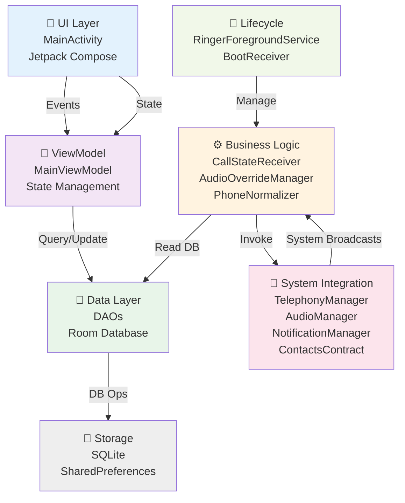
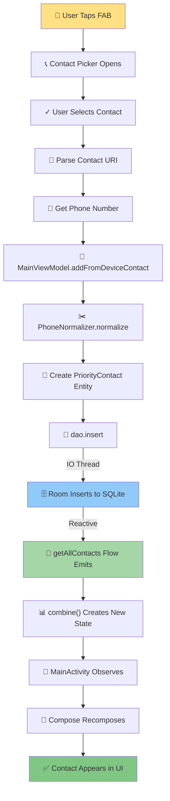
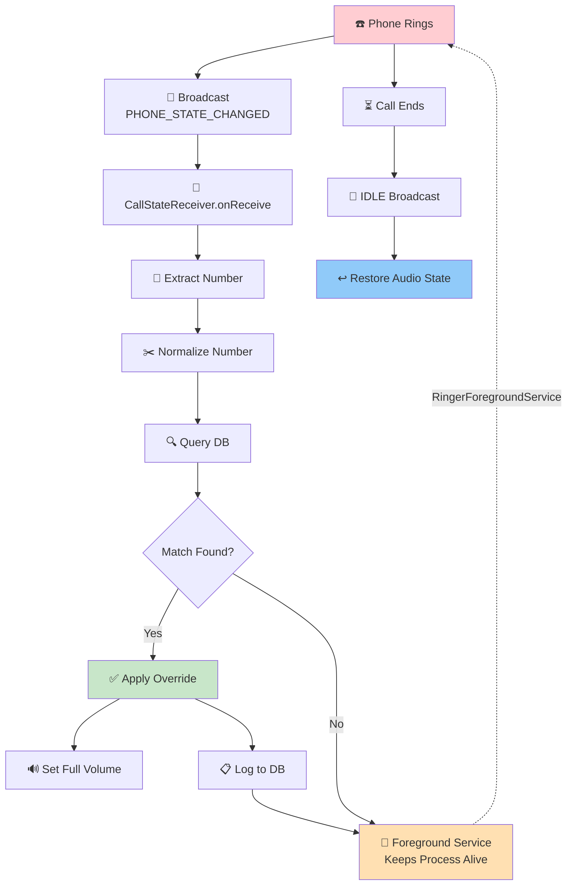
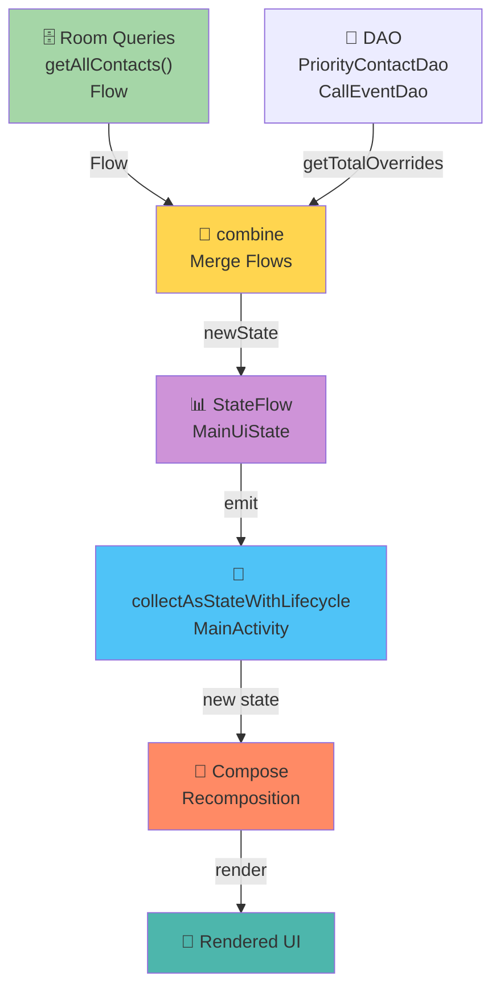

# EMERGENCY RINGER — COMPREHENSIVE CODEBASE ANALYSIS
**For: Senior Developer Onboarding**
**Date**: May 16, 2026
**Project**: Emergency Ringer Android Application

---

## TABLE OF CONTENTS
1. [Application Overview](#application-overview)
2. [Entry Flow](#entry-flow)
3. [Architecture Pattern](#architecture-pattern)
4. [Business Logic Flow](#business-logic-flow)
5. [Data Flow Analysis](#data-flow-analysis)
6. [Key Components](#key-components)
7. [Async & Event Flow](#async--event-flow)
8. [State Management](#state-management)
9. [External Dependencies](#external-dependencies)
10. [End-to-End Execution Scenarios](#end-to-end-execution-scenarios)
11. [Visual Diagrams](#visual-diagrams)
12. [Developer Onboarding Summary](#developer-onboarding-summary)

---

## APPLICATION OVERVIEW

**App Name**: Emergency Ringer  
**Purpose**: A specialized call-interception utility that forces the device to ring with full volume for priority contacts, overriding silent and vibration modes.

**Key Value Proposition**:
- Never miss calls from designated priority contacts (family, emergency services, etc.)
- Works even when phone is in silent or vibrate mode
- Persists across device reboots
- Lightweight, background service architecture
- No ads, minimal battery impact

**Target Workflow**:
```
User adds priority contacts → App stores in local DB → 
Incoming call detected → Check if caller in priority list →
If YES: Force full-volume ring → Ring loudly
If NO: Let normal call behavior proceed
```

---

## ENTRY FLOW

### 1. Application Startup Sequence

**Step 1a: Device Boot → BootReceiver Activated**
```
Device powers on
└─ Android broadcasts Intent.ACTION_BOOT_COMPLETED
   └─ BootReceiver.onReceive() triggered
      └─ RingerForegroundService.start(context) called
```
**File**: [app/src/main/java/com/example/emergencyringer/receiver/BootReceiver.kt](app/src/main/java/com/example/emergencyringer/receiver/BootReceiver.kt)
```kotlin
class BootReceiver : BroadcastReceiver() {
    override fun onReceive(context: Context, intent: Intent) {
        if (action == Intent.ACTION_BOOT_COMPLETED || 
            action == Intent.ACTION_MY_PACKAGE_REPLACED) {
            RingerForegroundService.start(context)  // ← Restart service
        }
    }
}
```

**Why Boot Receiver?**  
Without this, the app dies on reboot. The service must restart automatically.

---

**Step 1b: App Process Created → EmergencyRingerApp.onCreate()**

**File**: [app/src/main/java/com/example/emergencyringer/EmergencyRingerApp.kt](app/src/main/java/com/example/emergencyringer/EmergencyRingerApp.kt)

```kotlin
class EmergencyRingerApp : Application() {
    // ① Create database singleton
    val database: AppDatabase by lazy {
        Room.databaseBuilder(applicationContext, AppDatabase::class.java, DATABASE_NAME)
            .fallbackToDestructiveMigration()
            .build()
    }

    override fun onCreate() {
        super.onCreate()
        createNotificationChannels()  // ② Create notification channels for Android 8+
        RingerForegroundService.start(this)  // ③ Start foreground service
    }

    private fun createNotificationChannels() {
        // Channel 1: Low-priority persistent service notification
        NotificationChannel(CHANNEL_SERVICE, "Emergency Ringer Active", IMPORTANCE_LOW)
        
        // Channel 2: High-priority override alert notification
        NotificationChannel(CHANNEL_ALERT, "Override Triggered", IMPORTANCE_HIGH)
    }
}
```

**Initialization Order**:
1. Manifest declares application class as `EmergencyRingerApp`
2. Android creates app singleton and calls `onCreate()`
3. Database lazy-loads on first access (not yet initialized)
4. Notification channels created (required for Android O+)
5. `RingerForegroundService.start()` called → service thread spawns

---

**Step 1c: RingerForegroundService Starts**

**File**: [app/src/main/java/com/example/emergencyringer/service/RingerForegroundService.kt](app/src/main/java/com/example/emergencyringer/service/RingerForegroundService.kt)

```kotlin
class RingerForegroundService : Service() {
    override fun onStartCommand(intent: Intent?, flags: Int, startId: Int): Int {
        // Post foreground notification (prevents OS from killing service)
        startForeground(NOTIFICATION_ID, buildNotification())
        
        return START_STICKY  // ← If killed, restart automatically
    }
    
    override fun onBind(intent: Intent?): IBinder? = null  // ← No binding needed
}
```

**Key Design**:
- Foreground service = persistent notification always visible
- `START_STICKY` flag ensures Android restarts it if process dies
- Notification taps return user to MainActivity
- **Service does NOT execute business logic** — it's just a lifecycle anchor

---

**Step 1d: User Launches MainActivity (Manual Open)**

**File**: [app/src/main/java/com/example/emergencyringer/ui/MainActivity.kt](app/src/main/java/com/example/emergencyringer/ui/MainActivity.kt)

```kotlin
class MainActivity : ComponentActivity() {
    private val viewModel: MainViewModel by viewModels()  // ← Lazy initialize ViewModel
    
    override fun onCreate(savedInstanceState: Bundle?) {
        super.onCreate(savedInstanceState)
        
        requestRequiredPermissions()  // ① Request READ_PHONE_STATE, READ_CONTACTS, etc.
        
        setContent {  // ② Render Jetpack Compose UI
            val uiState by viewModel.uiState.collectAsStateWithLifecycle()
            val audioManager = remember { AudioOverrideManager(this) }
            
            EmergencyRingerScreen(
                uiState = uiState,
                onAddContact = { showContactPicker() },
                onRemoveContact = { viewModel.removeContact(it.id) },

                onOpenBatterySettings = { openBatterySettings() }
            )
        }
    }
}
```

### 2. Initialization Summary

```
┌─────────────────────────────────────────────┐
│           COLD START SEQUENCE               │
├─────────────────────────────────────────────┤
│ 1. EmergencyRingerApp.onCreate()            │
│    ├─ Lazy init AppDatabase (Room)          │
│    ├─ Create notification channels (O+)     │
│    └─ RingerForegroundService.start()       │
│       ├─ startForeground(notification)      │
│       └─ Return START_STICKY                │
│ 2. MainActivity onCreate()                  │
│    ├─ Request permissions                   │
│    └─ Render Compose UI                     │
│ 3. MainViewModel initialized                │
│    └─ Load contacts from DB (reactive)      │
└─────────────────────────────────────────────┘
```

---

## ARCHITECTURE PATTERN

### 1. Overall Pattern: MVVM + Repository Pattern

```
┌─────────────────────────────────────────────────────┐
│           ARCHITECTURE LAYERS                       │
├─────────────────────────────────────────────────────┤
│                                                     │
│  📱 PRESENTATION LAYER                             │
│  ├─ MainActivity (Jetpack Compose UI)              │
│  ├─ MainUiState (immutable state class)            │
│  └─ Composable functions (UI rendering)            │
│                                                     │
│  🎯 PRESENTATION LOGIC LAYER                       │
│  └─ MainViewModel                                   │
│     ├─ uiState: StateFlow<MainUiState>              │
│     ├─ addContact()                                 │
│     ├─ removeContact()                              │
│     └─ addFromDeviceContact()                       │
│                                                      │
│  📂 DATA LAYER (Implicit Repository)                │
│  ├─ PriorityContactDao (queries)                     │
│  ├─ CallEventDao (audit trail)                       │
│  ├─ PriorityContact (entity)                         │
│  ├─ CallEvent (entity)                               │
│  └─ AppDatabase (Room database)                      │
│                                                      │
│  ⚙️  BUSINESS LOGIC LAYER                           │
│  ├─ CallStateReceiver (call detection)              │
│  ├─ AudioOverrideManager (domain logic)             │
│  ├─ PhoneNormalizer (data transformation)           │
│  └─ RingerForegroundService (lifecycle)             │
│                                                     │
│  🔌 INTEGRATION LAYER                              │
│  ├─ BootReceiver (system hooks)                     │
│  ├─ CallStateReceiver (system broadcasts)           │
│  └─ SharedPreferences (audio state persistence)     │
│                                                     │
└─────────────────────────────────────────────────────┘
```

### 2. Layer Interactions

**PRESENTATION → PRESENTATION LOGIC**:
```
MainActivity (UI Event: user clicks "Add Contact")
    ↓
showContactPicker()
    ↓
contactPickerLauncher.launch()
    ↓
User selects contact
    ↓
parseAndAddContact(contactUri)
    ↓
viewModel.addFromDeviceContact(deviceContact)
```

**PRESENTATION LOGIC ↔ DATA**:
```
MainViewModel
    ↓ (viewModelScope.launch)
    ↓
dao.insert(contact)  // Coroutine → Room DAO
    ↓ (DB thread)
    ↓
PriorityContactDao inserts to SQLite
    ↓ (reactive: Flow<List<PriorityContact>>)
    ↓
uiState emits new state
    ↓
MainActivity re-composing UI
```

**BUSINESS LOGIC → SYSTEM INTEGRATION**:
```
Device rings
    ↓
CallStateReceiver.onReceive() (broadcast)
    ↓
handleRinging(number, app, audioManager)
    ↓
PhoneNormalizer.normalize(number)
    ↓
dao.getAllContactsOnce()  // DB query
    ↓
Match found?
    ├─ YES: AudioOverrideManager.applyOverride()
    └─ NO: Return
```

### 3. Dependency Injection Approach

**NOT using Hilt or Dagger** — using manual constructor injection + Application singleton:

```kotlin
class MainViewModel(application: Application) : AndroidViewModel(application) {
    private val app = application as EmergencyRingerApp  // ← Type-safe cast
    private val dao = app.database.priorityContactDao()   // ← Access DB from app
    private val callEventDao = app.database.callEventDao() // ← Access DAOs
}
```

**Why this approach?**
- Small codebase (no Hilt complexity)
- Explicit dependency graph (clear who needs what)
- Easy to test (pass mock app)
- No annotation processing overhead

---

## BUSINESS LOGIC FLOW

### 1. Main User Flow: Adding Priority Contacts

```
USER TAPS FAB "+" BUTTON
    ↓
┌─────────────────────────────────────────────────┐
│ MainActivity.onAddContact()                      │
├─────────────────────────────────────────────────┤
│ showContactPicker()                             │
│   ↓ contactPickerLauncher.launch(null)         │
│   ↓ OS contact picker opens                     │
│   ↓ User selects contact                        │
│   ↓ Returns contactUri                          │
└─────────────────────────────────────────────────┘
    ↓
┌─────────────────────────────────────────────────┐
│ MainActivity.parseAndAddContact(contactUri)     │
├─────────────────────────────────────────────────┤
│ ① Query ContactsContract.Contacts                │
│    - Extract: contactId, displayName, lookupKey │
│                                                  │
│ ② Query ContactsContract.CommonDataKinds.Phone │
│    - Extract: phone number for that contact     │
│    - Get PRIMARY phone if multiple              │
│                                                  │
│ ③ Create DeviceContact object                   │
│    displayName = "Mom"                           │
│    phoneNumber = "+91 98765 43210"              │
│    lookupKey = "0p1234567890"                   │
│                                                  │
│ ④ viewModel.addFromDeviceContact(deviceContact)│
└─────────────────────────────────────────────────┘
    ↓
┌─────────────────────────────────────────────────┐
│ MainViewModel.addFromDeviceContact()             │
├─────────────────────────────────────────────────┤
│ ① PhoneNormalizer.normalize("+91 98765 43210")  │
│    → Returns "9876543210" (last 10 digits)      │
│                                                  │
│ ② Create PriorityContact entity                 │
│    id = 0 (auto-generate)                       │
│    displayName = "Mom"                          │
│    phoneNumber = "9876543210"                   │
│    lookupKey = "0p1234567890"                   │
│    createdAt = System.currentTimeMillis()       │
│    isActive = true                              │
│                                                  │
│ ③ Launch coroutine in viewModelScope            │
│    dao.insert(contact)  // Suspending call      │
│    ↓ Executes on Room thread pool               │
│    ↓ SQLite INSERT INTO priority_contacts       │
│    ↓ Returns insertedId (e.g., 5)               │
└─────────────────────────────────────────────────┘
    ↓
┌─────────────────────────────────────────────────┐
│ Database reactive update                         │
├─────────────────────────────────────────────────┤
│ DAO query getAllContacts() emits new Flow       │
│ ↓ MainViewModel.uiState flow re-emits           │
│ ↓ MainActivity observes via collectAsStateWith  │
│    Lifecycle()                                   │
│ ↓ Recompose UI with new contact in list         │
└─────────────────────────────────────────────────┘
    ↓
UI UPDATED: "Mom" appears in priority contacts list
```

### 2. Core Business Logic: Call Detection & Override

```
🔔 DEVICE RINGS (Incoming Call)
    ↓
┌─────────────────────────────────────────────────┐
│ Android broadcasts Intent.ACTION_PHONE_STATE_   │
│ CHANGED with EXTRA_INCOMING_NUMBER              │
└─────────────────────────────────────────────────┘
    ↓
┌─────────────────────────────────────────────────┐
│ CallStateReceiver.onReceive()                    │
├─────────────────────────────────────────────────┤
│ Extract:                                         │
│  - state = TelephonyManager.EXTRA_STATE_RINGING │
│  - incomingNumber = "+91-9876543210"             │
│                                                  │
│ Route:                                           │
│  if (state == EXTRA_STATE_RINGING)               │
│    → handleRinging(number, app, audioManager)   │
│  else if (state == EXTRA_STATE_IDLE)             │
│    → handleIdle(app, audioManager)              │
└─────────────────────────────────────────────────┘
    ↓
┌─────────────────────────────────────────────────┐
│ CallStateReceiver.handleRinging()                │
├─────────────────────────────────────────────────┤
│ ① Validate: if (number.isBlank()) return         │
│                                                  │
│ ② Launch background coroutine (IO dispatcher)  │
│                                                  │
│ ③ PhoneNormalizer.normalize("+91-9876543210")  │
│    → "9876543210"                               │
│                                                  │
│ ④ Query DB: dao.getAllContactsOnce()           │
│    → Suspending query returns:                  │
│       [                                         │
│         PriorityContact(                        │
│           id=1, displayName="Mom",              │
│           phoneNumber="9876543210", ...         │
│         ),                                      │
│         ...                                     │
│       ]                                         │
│                                                  │
│ ⑤ MATCHING LOGIC:                               │
│    matchedContact = allContacts.firstOrNull {   │
│      PhoneNormalizer.matches(                   │
│        contact.phoneNumber = "9876543210",      │
│        incomingNumber = "9876543210"            │
│      )  → Returns TRUE                          │
│    }                                            │
│    → matchedContact = PriorityContact(name=     │
│        "Mom", ...)                              │
└─────────────────────────────────────────────────┘
    ↓
┌─────────────────────────────────────────────────┐
│ MATCH FOUND: Apply Audio Override                │
├─────────────────────────────────────────────────┤
│ audio.applyOverride()                            │
│   ↓ Calls: AudioOverrideManager.applyOverride() │
│                                                  │
│   ① saveCurrentState()                          │
│      Save to SharedPreferences:                 │
│      - ringerMode (VIBRATE)                     │
│      - ringVolume (0)                           │

│                                                  │
│   ② setFullVolume()                             │
│      - Set ringerMode = NORMAL                  │
│      - Set ring volume = MAX (e.g., 7/7)       │
│                                                  │

│      if (notificationPolicyAccessGranted) {     │
│        Set interruptionFilter = ALL             │
│      }                                          │
│                                                  │
│   ④ Set override_active = true in SharedPrefs   │
│                                                  │
│   Returns: true (override applied)              │
└─────────────────────────────────────────────────┘
    ↓
┌─────────────────────────────────────────────────┐
│ Audit Trail: Log Event to DB                     │
├─────────────────────────────────────────────────┤
│ callEventDao.insert(CallEvent(                   │
│   phoneNumber = "+91-9876543210",               │
│   displayName = "Mom",                          │
│   wasOverrideTriggered = true,                  │
│   previousRingerMode = VIBRATE,                 │
│   timestamp = System.currentTimeMillis()        │
│ ))                                              │
│ ↓ Fire-and-forget insert to DB                  │
└─────────────────────────────────────────────────┘
    ↓
🔊 PHONE RINGS AT FULL VOLUME (regardless of silent mode)
    ↓
┌─────────────────────────────────────────────────┐
│ Call Ends (or Missed)                            │
│   ↓ Android broadcasts EXTRA_STATE_IDLE         │
└─────────────────────────────────────────────────┘
    ↓
┌─────────────────────────────────────────────────┐
│ CallStateReceiver.handleIdle()                   │
├─────────────────────────────────────────────────┤
│ if (!prefs.getBoolean(KEY_OVERRIDE_ACTIVE))     │
│   return  // No override was active, do nothing │
│                                                  │
│ audio.restoreState()                            │
│   ① Retrieve saved state from SharedPreferences │
│      - savedMode = VIBRATE                      │
│      - savedVolume = 0                          │
│      - savedFilter = PRIORITY_ONLY              │
│                                                  │
│   ② Restore:                                    │
│      audio.ringerMode = VIBRATE                 │
│      audio.setStreamVolume(STREAM_RING, 0)     │

│                                                  │
│   ③ Set override_active = false                 │
└─────────────────────────────────────────────────┘
    ↓
✅ Phone returned to silent mode
```

### 3. Removal Flow: Deleting a Contact

```
USER SWIPES/TAPS DELETE ON "MOM" CONTACT CARD
    ↓
onRemoveContact(contact)
    ↓
MainViewModel.removeContact(contact.id)
    ↓
viewModelScope.launch {
  dao.softDelete(id=5)
}
    ↓
UPDATE priority_contacts 
SET is_active = 0 
WHERE id = 5
    ↓
Database reactive update
    ↓
UI refreshes: "Mom" disappears from list
```

**Why Soft Delete?**
- Future-proofs for cloud sync (deleted record still exists for sync)
- Preserves historical audit trail (call event references remain valid)
- Can be undeleted in v2.0

---

## DATA FLOW ANALYSIS

### 1. Complete Data Journey

```
┌────────────────────────────────────────────────────────┐
│              DATA FLOW ARCHITECTURE                     │
└────────────────────────────────────────────────────────┘

LAYER 1: PRESENTATION (UI State)
┌────────────────────────────────────────────────────────┐
│ MainUiState                                             │
│ ├─ priorityContacts: List<PriorityContact>             │
│ ├─ totalOverrides: Int                                 │
│ ├─ isServiceRunning: Boolean                           │

│ ├─ hasPhonePermission: Boolean                         │
│ └─ hasContactsPermission: Boolean                      │
└────────────────────────────────────────────────────────┘

LAYER 2: VIEW MODEL (State Management)
┌────────────────────────────────────────────────────────┐
│ MainViewModel                                           │
│ ├─ uiState: StateFlow<MainUiState>                    │
│ │  └─ combine(dao.getAllContacts(), callEventDao...)  │
│ │     ├─ Flow<List<PriorityContact>>                  │
│ │     └─ Flow<Int> (totalOverrides)                   │
│ │                                                      │
│ └─ Methods:                                            │
│    ├─ addContact(PriorityContact)                      │
│    ├─ removeContact(Long)                             │
│    └─ addFromDeviceContact(DeviceContact)             │
└────────────────────────────────────────────────────────┘

LAYER 3: DATA ACCESS (Room DAOs)
┌────────────────────────────────────────────────────────┐
│ PriorityContactDao                                      │
│ ├─ getAllContacts(): Flow<List<PriorityContact>>      │
│ ├─ getAllContactsOnce(): List<PriorityContact>        │
│ ├─ findByNumber(phone): PriorityContact?              │
│ ├─ insert(contact): Long                              │
│ ├─ update(contact): Unit                              │
│ ├─ softDelete(id): Unit                               │
│ └─ getActiveCount(): Flow<Int>                        │
│                                                        │
│ CallEventDao                                           │
│ ├─ insert(event): Unit                                │
│ ├─ getRecentEvents(): Flow<List<CallEvent>>           │
│ └─ getTotalOverrides(): Flow<Int>                     │
└────────────────────────────────────────────────────────┘

LAYER 4: DATA STORAGE (SQLite)
┌────────────────────────────────────────────────────────┐
│ TABLE: priority_contacts                               │
│ ├─ id (INTEGER, PK, auto-increment)                   │
│ ├─ phone_number (TEXT)                                │
│ ├─ display_name (TEXT)                                │
│ ├─ lookup_key (TEXT, nullable)                        │
│ ├─ created_at (LONG)                                  │
│ └─ is_active (BOOLEAN, default=1)                     │
│                                                        │
│ TABLE: call_events                                     │
│ ├─ id (INTEGER, PK, auto-increment)                   │
│ ├─ phone_number (TEXT)                                │
│ ├─ display_name (TEXT, nullable)                      │
│ ├─ was_override_triggered (BOOLEAN)                   │
│ ├─ previous_ringer_mode (INTEGER)                     │
│ └─ timestamp (LONG)                                   │
└────────────────────────────────────────────────────────┘

LAYER 5: PERSISTENCE (SharedPreferences)
┌────────────────────────────────────────────────────────┐
│ Pref: audio_override_state                             │
│ ├─ ringer_mode (Integer)                              │
│ ├─ ringer_volume (Integer)                            │

│ └─ override_active (Boolean)                          │
└────────────────────────────────────────────────────────┘
```

### 2. Data Flow: Contact Addition

```
┌────────────────────┐
│ UI Layer           │
│ User selects       │
│ contact from OS    │
└────────────────────┘
         ↓
┌────────────────────────────────────────┐
│ Parse Contact URI                      │
│ ContactsContract.Contacts.CONTENT_URI  │
│ ↓                                      │
│ Extract: id, displayName, lookupKey    │
└────────────────────────────────────────┘
         ↓
┌────────────────────────────────────────┐
│ Query Phone Number                     │
│ ContactsContract.CommonDataKinds.Phone │
│ ↓                                      │
│ Extract: primary phone number          │
└────────────────────────────────────────┘
         ↓
┌────────────────────────────────────────┐
│ Create DeviceContact Object            │
│ displayName = "Mom"                    │
│ phoneNumber = "+91 98765 43210"        │
│ lookupKey = "0p1234567890"             │
└────────────────────────────────────────┘
         ↓
┌────────────────────────────────────────┐
│ ViewModel Layer                        │
│ addFromDeviceContact(deviceContact)    │
└────────────────────────────────────────┘
         ↓
┌────────────────────────────────────────┐
│ Normalize Phone Number                 │
│ PhoneNormalizer.normalize()            │
│ "+91 98765 43210" → "9876543210"      │
│ (last 10 digits)                       │
└────────────────────────────────────────┘
         ↓
┌────────────────────────────────────────┐
│ Create Entity                          │
│ PriorityContact(                       │
│   displayName = "Mom",                 │
│   phoneNumber = "9876543210",          │
│   lookupKey = "0p1234567890",          │
│   isActive = true                      │
│ )                                      │
└────────────────────────────────────────┘
         ↓
┌────────────────────────────────────────┐
│ Persistence Layer (DAO)                │
│ dao.insert(contact)                    │
│ ↓                                      │
│ Suspending coroutine (IO dispatcher)   │
└────────────────────────────────────────┘
         ↓
┌────────────────────────────────────────┐
│ Database (SQLite)                      │
│ INSERT INTO priority_contacts VALUES(  │
│   NULL,            // auto id           │
│   '9876543210',    // phone             │
│   'Mom',           // name              │
│   '0p1234567890',  // lookup            │
│   <timestamp>,     // created_at        │
│   1                // is_active         │
│ )                                      │
└────────────────────────────────────────┘
         ↓
┌────────────────────────────────────────┐
│ Reactive Update                        │
│ dao.getAllContacts() emits new list    │
│ ↓                                      │
│ MainViewModel.uiState combines new     │
│ contact count + override count         │
│ ↓                                      │
│ StateFlow notifies subscribers         │
└────────────────────────────────────────┘
         ↓
┌────────────────────────────────────────┐
│ UI Layer                               │
│ MainActivity observes state change     │
│ ↓                                      │
│ Compose recomposes contact list        │
│ ↓                                      │
│ User sees "Mom" added to list          │
└────────────────────────────────────────┘
```

### 3. Data Flow: Incoming Call Processing

```
┌──────────────────────────────────┐
│ Call Detection                   │
│ TelephonyManager.ACTION_PHONE_   │
│ STATE_CHANGED broadcast          │
│ incomingNumber = "+91-9876543210"│
└──────────────────────────────────┘
         ↓
┌──────────────────────────────────────────┐
│ CallStateReceiver                        │
│ extract(state, incomingNumber)           │
│ ↓                                        │
│ if (state == RINGING) {                  │
│   → handleRinging(number)                │
│ }                                        │
└──────────────────────────────────────────┘
         ↓
┌──────────────────────────────────────────┐
│ Number Normalization                     │
│ PhoneNormalizer.normalize()              │
│ "+91-9876543210" → "9876543210"         │
└──────────────────────────────────────────┘
         ↓
┌──────────────────────────────────────────┐
│ Database Query (IO Thread)               │
│ dao.getAllContactsOnce()                 │
│ SELECT * FROM priority_contacts          │
│ WHERE is_active = 1                      │
└──────────────────────────────────────────┘
         ↓
┌──────────────────────────────────────────┐
│ In-Memory Matching                       │
│ for each contact {                       │
│   if (matches(contact.phone,             │
│       incomingNumber)) {                 │
│     matchedContact = contact             │
│     break                                │
│   }                                      │
│ }                                        │
└──────────────────────────────────────────┘
         ↓
        ┌─ MATCH FOUND ─┬─ NO MATCH ─┐
        ↓               ↓             ↓
    ┌─────────────┐    (Return,     ┌──────────┐
    │ Apply       │     no action)   │ Phone    │
    │ Override    │                  │ rings    │
    └─────────────┘                  │ normally │
        ↓                            └──────────┘
    ┌──────────────────┐
    │ AudioOverride    │
    │ Manager          │
    ├──────────────────┤
    │ 1. Save state    │
    │    (SharedPrefs) │
    │                  │
    │ 2. Set full vol  │
    │    (AudioManager)│
    │                  │

    │    (NotifMgr)    │
    └──────────────────┘
        ↓
    ┌──────────────────┐
    │ Audit Log        │
    │ callEventDao.    │
    │ insert(event)    │
    │ ↓                │
    │ INSERT into      │
    │ call_events      │
    └──────────────────┘
        ↓
    🔊 Ring at full volume
```

---

## KEY COMPONENTS

### 1. **EmergencyRingerApp** (Application Class)
**File**: [app/src/main/java/com/example/emergencyringer/EmergencyRingerApp.kt](app/src/main/java/com/example/emergencyringer/EmergencyRingerApp.kt)

**Responsibility**: 
- Singleton app instance
- Database initialization
- Notification channel setup
- Service lifecycle management

**Key Methods**:
```kotlin
fun onCreate()                      // Called on app process creation
private fun createNotificationChannels()  // Register channels for O+
```

**Dependencies**:
- Room (database)


**Accessed By**:
- MainActivity (via application as EmergencyRingerApp)
- ViewModels (via AndroidViewModel.getApplication())
- Receivers (via context.applicationContext as EmergencyRingerApp)

**Critical Methods**:
```kotlin
// Lazy DB singleton — initialized on first access
val database: AppDatabase by lazy { ... }
```

---

### 2. **MainActivity** (UI Entry Point)
**File**: [app/src/main/java/com/example/emergencyringer/ui/MainActivity.kt](app/src/main/java/com/example/emergencyringer/ui/MainActivity.kt)

**Responsibility**:
- User interface rendering (Jetpack Compose)
- Permission handling
- Contact picker integration
- Settings navigation

**Key Methods**:
```kotlin
fun onCreate(savedInstanceState)    // Activity lifecycle
fun requestRequiredPermissions()    // Request READ_PHONE_STATE, READ_CONTACTS
fun showContactPicker()             // Launch OS contact picker
fun parseAndAddContact(contactUri)  // Parse contact, call ViewModel

fun openBatterySettings()           // Navigate to battery optimization
```

**Dependencies**:
- MainViewModel

- ActivityResultContracts

**Role in Workflow**:
- Entry point for user interaction
- Displays contact list (from ViewModel)
- Triggers contact addition/removal
- Shows permission warnings

**Critical Composables**:
```kotlin
fun EmergencyRingerScreen()   // Main UI scaffold
fun HeaderCard()              // Shows status
fun ContactRow()              // Single contact item
fun WarningCard()             // Permission/setup warnings
```

---

### 3. **MainViewModel** (State Management)
**File**: [app/src/main/java/com/example/emergencyringer/ui/MainViewModel.kt](app/src/main/java/com/example/emergencyringer/ui/MainViewModel.kt)

**Responsibility**:
- Manage UI state reactively
- Handle business logic for contact management
- Device contact querying
- Bridge UI and data layers

**Key Methods**:
```kotlin
// REACTIVE STATE
val uiState: StateFlow<MainUiState>  // Combines all data sources

// CONTACT MANAGEMENT
fun addContact(contact)              // Direct DB insert
fun removeContact(contactId)         // Soft delete
fun addFromDeviceContact(device)     // Normalize + insert
fun fetchDeviceContacts()            // Query Android contacts
```

**Dependencies**:
- Application (for DB access)
- Room DAOs (PriorityContactDao, CallEventDao)
- PhoneNormalizer

**State Flow**:
```kotlin
uiState = combine(
    dao.getAllContacts(),      // Reacts to DB changes
    callEventDao.getTotalOverrides()  // Reacts to call events
) { contacts, overrides ->
    MainUiState(
        priorityContacts = contacts,
        totalOverrides = overrides,
        isServiceRunning = true,

        hasPhonePermission = false     // Updated in MainActivity
    )
}.stateIn(
    viewModelScope,
    SharingStarted.WhileSubscribed(5000),  // Active while observed
    MainUiState()  // Initial state
)
```

**Critical Feature**:
- Uses `SharingStarted.WhileSubscribed(5000)` to stop collecting when no UI observers
- Automatically cleans up on activity destruction

---

### 4. **CallStateReceiver** (Call Detection & Core Logic)
**File**: [app/src/main/java/com/example/emergencyringer/receiver/CallStateReceiver.kt](app/src/main/java/com/example/emergencyringer/receiver/CallStateReceiver.kt)

**Responsibility**:
- Listen for phone state broadcasts
- Detect incoming calls
- Match against priority contacts
- Trigger audio override
- Restore audio state on call end

**Key Methods**:
```kotlin
fun onReceive(context, intent)       // Called on phone state change
private fun handleRinging(...)       // Check priority list + override
private fun handleIdle(...)          // Restore audio state
```

**Execution Model**:
- Broadcast receiver (runs in main process thread)
- Uses `CoroutineScope(Dispatchers.IO)` for non-blocking DB queries
- Fire-and-forget audit logging

**Call Chain**:
```
onReceive() 
  ├─ Extract phone state + number
  ├─ Route to handler (RINGING/IDLE/OFFHOOK)
  ├─ Launch IO coroutine
  ├─ Normalize number
  ├─ Query DB for matching contact
  ├─ If match: AudioOverrideManager.applyOverride()
  └─ Log event to DB
```

**Critical Logic - Matching**:
```kotlin
val normalizedIncoming = PhoneNormalizer.normalize(number)
val matchedContact = allContacts.firstOrNull { contact ->
    PhoneNormalizer.matches(contact.phoneNumber, normalizedIncoming)
}
// Returns first match or null
```

---

### 5. **AudioOverrideManager** (Domain Logic)
**File**: [app/src/main/java/com/example/emergencyringer/util/AudioOverrideManager.kt](app/src/main/java/com/example/emergencyringer/util/AudioOverrideManager.kt)

**Responsibility**:
- Save phone audio state before modification
- Apply full-volume ring override

- Perfectly restore previous state

**Key Methods**:
```kotlin
fun applyOverride(): Boolean        // Save + set full volume
fun restoreState(): Unit            // Restore from SharedPreferences
fun isOverrideCurrentlyActive(): Boolean  // Check state
```

**State Persistence**:
Uses SharedPreferences to survive process crash:
```
audio_override_state {
  ringer_mode: Int          // AudioManager.RINGER_MODE_*
  ringer_volume: Int        // 0-7 typically

  override_active: Boolean  // Flag to prevent double-restore
}
```

**Override Logic**:
```
APPLY:
  1. saveCurrentState()           → Save ringer mode + volume to SharedPrefs
  2. setFullVolume()              → Set mode=NORMAL, vol=MAX
  3. Set override_active=true     → Mark override active

RESTORE:
  1. Check override_active flag   → Return if false (nothing to restore)
  2. Retrieve saved state         → From SharedPrefs
  3. Restore ringerMode           → Set back to VIBRATE/SILENT
  4. Restore ringVolume           → Set back to saved level
  5. Set override_active=false    → Mark as inactive
```

**Why SharedPreferences?**
- Audio state must survive app/service crash
- Prevents "stuck at max volume" scenarios  
- Quick access (not persisted to DB for every call)
- Lightweight state management for temporary overrides

---

### 6. **RingerForegroundService** (Process Lifecycle Anchor)
**File**: [app/src/main/java/com/example/emergencyringer/service/RingerForegroundService.kt](app/src/main/java/com/example/emergencyringer/service/RingerForegroundService.kt)

**Responsibility**:
- Keep app process alive with foreground notification
- Ensure CallStateReceiver remains active
- NO business logic here (just lifecycle management)

**Key Methods**:
```kotlin
fun onStartCommand(intent, flags, startId): Int  // Start service
fun onBind(intent): IBinder?                      // No binding
fun onDestroy(): Unit                             // Log destruction
```

**Lifecycle Flag**:
```kotlin
return START_STICKY  // If killed by OS, restart automatically
```

**Notification**:
```
"Emergency Ringer Active"
"Monitoring calls from priority contacts"
[Tap to open app] ← PendingIntent to MainActivity
```

**Why Foreground Service?**
- Android won't kill app process while showing notification
- CallStateReceiver stays registered
- Works with Doze/Battery Optimization

---

### 7. **Database & DAOs** (Data Persistence)
**File**: [app/src/main/java/com/example/emergencyringer/data/Database.kt](app/src/main/java/com/example/emergencyringer/data/Database.kt)

**Entities**:

**PriorityContact**:
```kotlin
@Entity(tableName = "priority_contacts")
data class PriorityContact(
    @PrimaryKey(autoGenerate = true) val id: Long = 0,
    @ColumnInfo(name = "phone_number") val phoneNumber: String,
    @ColumnInfo(name = "display_name") val displayName: String,
    @ColumnInfo(name = "lookup_key") val lookupKey: String? = null,
    @ColumnInfo(name = "created_at") val createdAt: Long = System.currentTimeMillis(),
    @ColumnInfo(name = "is_active") val isActive: Boolean = true
)
```

**CallEvent**:
```kotlin
@Entity(tableName = "call_events")
data class CallEvent(
    @PrimaryKey(autoGenerate = true) val id: Long = 0,
    @ColumnInfo(name = "phone_number") val phoneNumber: String,
    @ColumnInfo(name = "display_name") val displayName: String?,
    @ColumnInfo(name = "was_override_triggered") val wasOverrideTriggered: Boolean,
    @ColumnInfo(name = "previous_ringer_mode") val previousRingerMode: Int,
    @ColumnInfo(name = "timestamp") val timestamp: Long = System.currentTimeMillis()
)
```

**DAOs**:

```kotlin
interface PriorityContactDao {
    @Query("SELECT * FROM priority_contacts WHERE is_active = 1 ORDER BY display_name ASC")
    fun getAllContacts(): Flow<List<PriorityContact>>
    
    @Query("SELECT * FROM priority_contacts WHERE is_active = 1 ORDER BY display_name ASC")
    suspend fun getAllContactsOnce(): List<PriorityContact>
    
    @Insert(onConflict = OnConflictStrategy.REPLACE)
    suspend fun insert(contact: PriorityContact): Long
    
    @Query("UPDATE priority_contacts SET is_active = 0 WHERE id = :id")
    suspend fun softDelete(id: Long)
    
    @Query("SELECT COUNT(*) FROM priority_contacts WHERE is_active = 1")
    fun getActiveCount(): Flow<Int>
}

interface CallEventDao {
    @Insert
    suspend fun insert(event: CallEvent)
    
    @Query("SELECT * FROM call_events ORDER BY timestamp DESC LIMIT 50")
    fun getRecentEvents(): Flow<List<CallEvent>>
    
    @Query("SELECT COUNT(*) FROM call_events WHERE was_override_triggered = 1")
    fun getTotalOverrides(): Flow<Int>
}
```

**Database**:
```kotlin
@Database(
    entities = [PriorityContact::class, CallEvent::class],
    version = 1,
    exportSchema = true
)
abstract class AppDatabase : RoomDatabase() {
    abstract fun priorityContactDao(): PriorityContactDao
    abstract fun callEventDao(): CallEventDao
}
```

---

### 8. **PhoneNormalizer** (Data Transformation)
**File**: [app/src/main/java/com/example/emergencyringer/util/PhoneNormalizer.kt](app/src/main/java/com/example/emergencyringer/util/PhoneNormalizer.kt)

**Responsibility**:
- Normalize phone numbers to comparable format
- Match incoming numbers against stored numbers
- Handle international format variations

**Key Methods**:
```kotlin
fun normalize(raw: String): String
  // "+91 98765 43210" → "9876543210"
  // "09876543210"    → "9876543210"
  // "+919876543210"  → "9876543210"
  // Returns last 10 significant digits

fun matches(a: String, b: String): Boolean
  // Returns: normalize(a) == normalize(b)
```

**Design**:
- Takes last 10 digits (SIGNIFICANT_DIGITS = 10)
- Strips all non-digits
- Handles international +91 prefixes, spaces, hyphens
- No external libphonenumber dependency (lightweight)

**Why not use E.164?**
- Without libphonenumber, can't determine country code
- Last 10 digits approach works for most use cases
- Simpler, faster, smaller footprint

---

### 9. **BootReceiver** (System Integration)
**File**: [app/src/main/java/com/example/emergencyringer/receiver/BootReceiver.kt](app/src/main/java/com/example/emergencyringer/receiver/BootReceiver.kt)

**Responsibility**:
- Restart service after device reboot
- Restart service after app package update
- Ensure continuity after system events

**Key Methods**:
```kotlin
fun onReceive(context, intent)
  // Listens for:
  // - Intent.ACTION_BOOT_COMPLETED
  // - Intent.ACTION_MY_PACKAGE_REPLACED
  // Action: RingerForegroundService.start(context)
```

**Why Needed?**
- App process dies on reboot
- Service registration is lost
- Receiver auto-restarts via broadcast
- User never needs to manually reopen app

---

## ASYNC & EVENT FLOW

### 1. Coroutine Architecture

**Dispatchers Used**:
```
├─ Main           → UI updates only (Compose recomposition)
├─ Default        → CPU-intensive work (not used here)
├─ IO             → DB queries, file I/O
│  ├─ Used by: Room DAO queries
│  ├─ Used by: ContactsContract queries
│  └─ Used by: CallStateReceiver async blocks
└─ Unconfined     → (not used, avoid)
```

**Coroutine Scopes**:

```
1. viewModelScope (MainViewModel)
   ├─ Lifecycle: tied to ViewModel
   ├─ Cancellation: on ViewModel cleared
   ├─ Used for: Contact CRUD operations
   └─ Example:
      viewModelScope.launch(Dispatchers.IO) {
        dao.insert(contact)  // Suspending
      }

2. CoroutineScope(Dispatchers.IO) (CallStateReceiver)
   ├─ Lifecycle: application lifetime
   ├─ Cancellation: SupervisorJob (one failure doesn't cancel all)
   ├─ Used for: Call detection + DB lookup
   └─ Example:
      scope.launch {
        val contacts = dao.getAllContactsOnce()
        // DB query happens on IO thread
      }
```

### 2. Reactive Data Flow (Flows & StateFlow)

**Flow Chains**:
```
Room Query (Flow)
  ↓
  dao.getAllContacts()
  └─ Emits whenever DB changes
  └─ Never completes (infinite flow)

↓ Transform in ViewModel

combine(
  dao.getAllContacts(),
  callEventDao.getTotalOverrides()
) { contacts, overrides ->
  MainUiState(
    priorityContacts = contacts,
    totalOverrides = overrides
  )
}

↓ Convert to StateFlow

.stateIn(
  viewModelScope,
  SharingStarted.WhileSubscribed(5000),
  MainUiState()  // Default state
)

↓ Observe in UI

val uiState by viewModel.uiState.collectAsStateWithLifecycle()

↓ Recompose on state change

Compose recomposes UI with new state
```

**Key Reactive Concepts**:

```
Flow<T>
  └─ Cold stream (doesn't emit until collected)
  └─ Can have multiple collectors

StateFlow<T> extends Flow<T>
  └─ Hot stream (always has a value)
  └─ Only newest value available
  └─ collectAsStateWithLifecycle() observes lifecycle
     └─ Stops collecting when activity goes to background
     └─ Prevents memory leaks
```

### 3. Background Thread Management

**CallStateReceiver**:
```
UI/System Thread (BroadcastReceiver.onReceive runs here)
  │
  ├─ Extract intent data (fast)
  │
  └─ Launch coroutine on IO thread
     │
     ├─ PhoneNormalizer.normalize()  ← Fast string ops
     │
     ├─ dao.getAllContactsOnce()     ← DB query (suspending)
     │  └─ Room thread pool (IO dispatcher)
     │     └─ SQL execution
     │
     ├─ Match logic in-memory         ← Fast list iteration
     │
     ├─ AudioOverrideManager.applyOverride()  ← Audio system calls
     │  └─ Happens on IO thread (could move to Main for clarity)
     │
     └─ dao.insert(callEvent)        ← Fire-and-forget logging
        └─ Room thread pool
```

**Safety**:
- BroadcastReceiver.onReceive() must finish within 10 seconds
- Async coroutine doesn't block the receiver
- If logic takes >10s, receiver times out but coroutine continues

### 4. Broadcast Event Flow

```
PHONE STATE BROADCASTS

Device receives call
  │
  ├─ Android system broadcasts
  │  └─ Intent.ACTION_PHONE_STATE_CHANGED
  │  └─ EXTRA_STATE = "RINGING"
  │  └─ EXTRA_INCOMING_NUMBER = "+919876543210"
  │
  ├─ All registered receivers get broadcast
  │  └─ CallStateReceiver.onReceive()
  │  └─ (Can have priority = 999 to receive first)
  │
  ├─ Receiver processes asynchronously (IO thread)
  │
  └─ Broadcast complete

Call answered
  │
  └─ Android broadcasts
     └─ EXTRA_STATE = "OFFHOOK"
     └─ CallStateReceiver ignores (keeps override active)

Call ends
  │
  └─ Android broadcasts
     └─ EXTRA_STATE = "IDLE"
     └─ CallStateReceiver.handleIdle()
     └─ AudioOverrideManager.restoreState()
```

---

## STATE MANAGEMENT

### 1. Where State Lives

```
┌─────────────────────────────────────────────────────────┐
│              STATE MANAGEMENT ARCHITECTURE              │
└─────────────────────────────────────────────────────────┘

UI LAYER
┌────────────────────────────────────────┐
│ MainActivity                           │
│ └─ Local composable state (if needed)  │
│    └─ isDropdownOpen, selectedTab, etc │
│    └─ Lives in @Composable function    │
│    └─ Resets on recomposition          │
└────────────────────────────────────────┘

APPLICATION STATE (Single Source of Truth)
┌────────────────────────────────────────┐
│ MainViewModel                          │
│ └─ uiState: StateFlow<MainUiState>    │
│    ├─ priorityContacts: List[...]     │
│    ├─ totalOverrides: Int              │
│    ├─ hasPhonePermission: Boolean      │
│    └─ hasContactsPermission: Boolean   │
│                                        │
│ Lifetime: Activity → ViewModel scoped  │
│           (survives config changes)    │
└────────────────────────────────────────┘

PERSISTENT STATE
┌────────────────────────────────────────┐
│ Room Database                          │
│ └─ priority_contacts table             │
│ └─ call_events table                   │
│                                        │
│ Lifetime: App installation lifetime    │
└────────────────────────────────────────┘

TRANSIENT STATE
┌────────────────────────────────────────┐
│ SharedPreferences (audio_override_     │
│ state)                                 │
│ ├─ ringer_mode: saved state            │
│ ├─ ringer_volume: saved state          │
│ └─ override_active: flag               │
│                                        │
│ Lifetime: Until explicitly cleared    │
│           (survives crashes/reboots)   │
└────────────────────────────────────────┘
```

### 2. State Update Flow

```
TRIGGERING STATE CHANGE

User Action (Add Contact)
  │
  └─ MainActivity.onAddContact()
     └─ showContactPicker()
     └─ contactPickerLauncher callback
     └─ parseAndAddContact(uri)
     └─ viewModel.addFromDeviceContact(device)
        │
        └─ viewModelScope.launch(Dispatchers.IO)
           │
           ├─ Create PriorityContact entity
           │
           └─ dao.insert(contact)
              │
              ├─ Suspending call
              ├─ Executes on Room thread pool
              ├─ INSERT into SQLite
              └─ Returns insertedId

DATABASE REACTIVE PROPAGATION
  │
  ├─ Room observes table change
  ├─ Emits new list via getAllContacts() Flow
  │
  └─ MainViewModel's combine() operator
     │
     ├─ Receives new contact list
     ├─ Combines with totalOverrides flow
     │
     └─ Emits new MainUiState
        │
        └─ StateFlow holds new state
           │
           └─ Notifies all collectors
              │
              └─ MainActivity observes via
                 collectAsStateWithLifecycle()
                 │
                 └─ Triggers recomposition
                    │
                    └─ Compose renders new UI
                       │
                       └─ User sees new contact in list
```

### 3. State Mutations

**Contact Addition**:
```
MainUiState(
  priorityContacts = [        // ← MUTATED
    ...existing contacts,
    PriorityContact(
      id=5, 
      displayName="Mom", 
      phoneNumber="9876543210"
    )
  ]
)
```

**Override Statistics**:
```
MainUiState(
  totalOverrides = 42         // ← MUTATED
  // Incremented when CallEvent with 
  // wasOverrideTriggered=true inserted
)
```

**Permission Changes**:
```
MainUiState(
  hasPhonePermission = true   // ← UPDATED by MainActivity
  hasContactsPermission = true  // ← UPDATED by MainActivity
)
```

---

## EXTERNAL DEPENDENCIES

### 1. System Permissions & Services

**READ_PHONE_STATE**
- Used by: CallStateReceiver
- Purpose: Detect incoming call phone numbers
- Required: API 31+
- Feature: Don't Call List (blocks certain numbers)

**READ_CALL_LOG**
- Used by: Audit trail logging
- Purpose: Historical call records (CallEvent table)
- Required: API 16+

**READ_CONTACTS**
- Used by: MainActivity (contact picker)
- Purpose: List device contacts
- Required: API 16+

**MODIFY_AUDIO_SETTINGS**
- Used by: AudioOverrideManager
- Purpose: Set ringer mode, volume
- Required: API 1+
- No grant needed (normal permission)

**FOREGROUND_SERVICE**
- Used by: RingerForegroundService
- Purpose: Show persistent notification
- Required: API 28+

**FOREGROUND_SERVICE_SPECIAL_USE**
- Used by: RingerForegroundService (Android 12+)
- Purpose: Declare special use case
- Required: API 31+

**RECEIVE_BOOT_COMPLETED**
- Used by: BootReceiver
- Purpose: Receive reboot broadcasts
- Required: API 1+

**WAKE_LOCK**
- Used by: Potentially for wakelock if added
- Purpose: Keep CPU awake during calls
- Required: API 1+

**REQUEST_IGNORE_BATTERY_OPTIMIZATIONS**
- Used by: MainActivity (settings link)
- Purpose: Disable battery optimization
- Required: API 31+

### 2. Android System Services

**AudioManager**
```
Context.AUDIO_SERVICE
├─ ringerMode property          ← Get/set silence, vibrate, normal
├─ getStreamVolume()            ← Get current volume
├─ setStreamVolume()            ← Set volume
├─ STREAM_RING                  ← Which audio stream
├─ RINGER_MODE_SILENT           ← Silent mode
├─ RINGER_MODE_VIBRATE          ← Vibration mode
└─ RINGER_MODE_NORMAL           ← Normal mode
```


**TelephonyManager**
```
System broadcast intent
├─ ACTION_PHONE_STATE_CHANGED  ← Listen for state changes
├─ EXTRA_STATE_RINGING         ← Phone ringing
├─ EXTRA_STATE_OFFHOOK         ← Call answered
├─ EXTRA_STATE_IDLE            ← Call ended
└─ EXTRA_INCOMING_NUMBER       ← Caller's number
```

**ContactsContract**
```
Android Contacts Provider
├─ CommonDataKinds.Phone.CONTENT_URI
│  └─ Query device phone contacts
│  └─ Get DISPLAY_NAME, NUMBER, LOOKUP_KEY
│
└─ Contacts.CONTENT_URI
   └─ Query contact details by ID
   └─ Get DISPLAY_NAME, LOOKUP_KEY
```

### 3. Android Architecture Components

**Room Database**
- Version: 2.6.1
- Purpose: SQLite abstraction
- Features: Type-safe queries, Flow integration, migrations
- Usage: Store priority contacts + call audit trail

**Jetpack Compose**
- Version: 2024.02.00 (compose-bom)
- Purpose: Modern declarative UI
- Features: State-driven rendering, recomposition

**Kotlin Coroutines**
- Version: 1.7.3
- Purpose: Async/await, structured concurrency
- Features: Suspending functions, scopes, dispatchers

**Lifecycle Components**
- ViewModel: State management across config changes
- AndroidViewModel: Access to Application context
- collectAsStateWithLifecycle(): Lifecycle-aware state observation

---

## END-TO-END EXECUTION SCENARIOS

### SCENARIO 1: User Opens App for First Time

```
┌────────────────────────────────────────────────────────┐
│ STEP 1: App Process Created                            │
├────────────────────────────────────────────────────────┤
│ • User taps Emergency Ringer icon on launcher          │
│ • Android creates new process                          │
│ • Zygote spawns app process with PID                   │
│ • Android runtime initializes (Dalvik/ART)            │
│ • Manifest parsed                                       │
└────────────────────────────────────────────────────────┘
        ↓
┌────────────────────────────────────────────────────────┐
│ STEP 2: EmergencyRingerApp.onCreate()                  │
├────────────────────────────────────────────────────────┤
│ • Application class instantiated                        │
│ • super.onCreate() called                              │
│ • createNotificationChannels()                         │
│   └─ CHANNEL_SERVICE (low importance)                  │
│   └─ CHANNEL_ALERT (high importance)                   │
│ • RingerForegroundService.start(this) called           │
└────────────────────────────────────────────────────────┘
        ↓
┌────────────────────────────────────────────────────────┐
│ STEP 3: RingerForegroundService.onStartCommand()      │
├────────────────────────────────────────────────────────┤
│ • startForeground(1001, notification)                  │
│ • Notification posted to CHANNEL_SERVICE               │
│ • User sees: "Emergency Ringer Active"                 │
│ • return START_STICKY                                  │
│   └─ If killed, system will restart                    │
│   └─ Intent = null on restart                          │
└────────────────────────────────────────────────────────┘
        ↓
┌────────────────────────────────────────────────────────┐
│ STEP 4: MainActivity.onCreate()                        │
├────────────────────────────────────────────────────────┤
│ • Activity instantiated                                │
│ • savedInstanceState = null (first time)               │
│ • requestRequiredPermissions()                         │
│   └─ Check READ_PHONE_STATE (likely denied)            │
│   └─ Check READ_CALL_LOG (likely denied)               │
│   └─ Check READ_CONTACTS (likely denied)               │
│   ├─ All denied? Launch permissionLauncher             │
│   └─ System permission dialog shown                    │
│ • setContent { EmergencyRingerScreen(...) }            │
└────────────────────────────────────────────────────────┘
        ↓
┌────────────────────────────────────────────────────────┐
│ STEP 5: MainViewModel Initialization                   │
├────────────────────────────────────────────────────────┤
│ • ViewModelFactory creates MainViewModel               │
│ • constructor receives Application                     │
│ • dao = app.database.priorityContactDao()              │
│   └─ First access to database property                 │
│   └─ Room.databaseBuilder() executes                   │
│   └─ SQLite connection opens                           │
│   └─ Schema created (empty tables)                     │
│ • callEventDao = app.database.callEventDao()           │
│ • uiState StateFlow initialized:                       │
│   ├─ combine(                                          │
│   │   dao.getAllContacts(),    ← Flow<[]> (empty list)│
│   │   callEventDao.getTotalOverrides()  ← Flow<0>     │
│   │ ) { contacts, overrides ->                        │
│   │   MainUiState(                                    │
│   │     priorityContacts = [],                        │
│   │     totalOverrides = 0,                           │
│   │     ...                                           │
│   │   )                                               │
│   │ }                                                 │
│   └─ Active collection begins                          │
└────────────────────────────────────────────────────────┘
        ↓
┌────────────────────────────────────────────────────────┐
│ STEP 6: UI Renders                                     │
├────────────────────────────────────────────────────────┤
│ • val uiState by viewModel.uiState.                    │
│   collectAsStateWithLifecycle()                        │
│   └─ Current state: empty contact list, 0 overrides   │
│ • EmergencyRingerScreen(uiState) recomposed            │
│ • Displays:                                            │
│   ├─ HeaderCard (green checkmark: not all good)        │
│   ├─ WarningCard("Phone Permission Required")         │
│   ├─ WarningCard("Disable Battery Optimization")      │
│   ├─ Section: "Priority Contacts (0 contacts)"        │
│   ├─ EmptyContactsCard (tap to add first)             │
│   └─ FAB: Add button                                  │
│ • User sees empty state                                │
└────────────────────────────────────────────────────────┘
        ↓
┌────────────────────────────────────────────────────────┐
│ STEP 7: User Grants Permissions                        │
├────────────────────────────────────────────────────────┤
│ • permissionLauncher dialog shown                      │
│ • User taps "Allow" for each permission                │
│ • BroadcastReceiver callback received in main thread   │
│ • MainActivity re-renders with permissions granted     │
│ • HeaderCard now shows: all good (green checkmark)    │
│ • WarningCard about phone permissions disappears       │
│ • Only "Disable Battery Optimization" warning shows    │
└────────────────────────────────────────────────────────┘
```

### SCENARIO 2: User Adds First Contact

```
┌────────────────────────────────────────────────────────┐
│ STEP 1: FAB Clicked                                    │
├────────────────────────────────────────────────────────┤
│ • onAddContact() callback invoked                      │
│ • viewModel.showContactPicker() called                 │
│ • contactPickerLauncher.launch(null)                   │
│ • System contact picker activity started               │
│ • User sees contact list from device                   │
└────────────────────────────────────────────────────────┘
        ↓
┌────────────────────────────────────────────────────────┐
│ STEP 2: User Selects Contact                          │
├────────────────────────────────────────────────────────┤
│ • User finds "Mom" in contacts                         │
│ • User taps on "Mom"                                   │
│ • Intent returned with contactUri =                    │
│   content://com.android.contacts/contacts/1234        │
└────────────────────────────────────────────────────────┘
        ↓
┌────────────────────────────────────────────────────────┐
│ STEP 3: Parse Contact URI                             │
├────────────────────────────────────────────────────────┤
│ • contactPickerLauncher.callback(contactUri)           │
│ • MainActivity.parseAndAddContact(uri)                 │
│ • Query: ContentResolver.query(                        │
│     uri,                                               │
│     [DISPLAY_NAME, LOOKUP_KEY, _ID],                  │
│     null, null, null                                   │
│   )                                                   │
│ • Result cursor has 1 row:                            │
│   ├─ DISPLAY_NAME = "Mom"                             │
│   ├─ LOOKUP_KEY = "0p1234567890"                      │
│   └─ _ID = "1234"                                     │
└────────────────────────────────────────────────────────┘
        ↓
┌────────────────────────────────────────────────────────┐
│ STEP 4: Get Phone Number                              │
├────────────────────────────────────────────────────────┤
│ • Query: ContentResolver.query(                        │
│     Phone.CONTENT_URI,                                 │
│     [NUMBER],                                         │
│     "contact_id = ?",                                 │
│     ["1234"],                                         │
│     "is_primary DESC LIMIT 1"                         │
│   )                                                   │
│ • Result: NUMBER = "+91-9876543210"                   │
└────────────────────────────────────────────────────────┘
        ↓
┌────────────────────────────────────────────────────────┐
│ STEP 5: Create DeviceContact Object                    │
├────────────────────────────────────────────────────────┤
│ val deviceContact = DeviceContact(                     │
│   displayName = "Mom",                                 │
│   phoneNumber = "+91-9876543210",                     │
│   lookupKey = "0p1234567890"                          │
│ )                                                     │
└────────────────────────────────────────────────────────┘
        ↓
┌────────────────────────────────────────────────────────┐
│ STEP 6: ViewModel Add Contact                          │
├────────────────────────────────────────────────────────┤
│ • viewModel.addFromDeviceContact(deviceContact)        │
│ • Log: "addFromDeviceContact() called"                │
│ • PhoneNormalizer.normalize("+91-9876543210")         │
│   └─ Strip non-digits: "919876543210"                 │
│   └─ Take last 10: "9876543210"                       │
│   └─ Result: "9876543210"                             │
└────────────────────────────────────────────────────────┘
        ↓
┌────────────────────────────────────────────────────────┐
│ STEP 7: Launch Coroutine & Insert                      │
├────────────────────────────────────────────────────────┤
│ • viewModelScope.launch(Dispatchers.IO) {              │
│   ├─ Create PriorityContact entity:                    │
│   │  PriorityContact(                                  │
│   │    id = 0 (auto-generate),                        │
│   │    displayName = "Mom",                            │
│   │    phoneNumber = "9876543210",                    │
│   │    lookupKey = "0p1234567890",                    │
│   │    createdAt = 1715865432123L,                    │
│   │    isActive = true                                │
│   │  )                                                │
│   │                                                   │
│   ├─ dao.insert(contact)  ← Suspending call           │
│   │  ├─ Executes on Room thread pool                  │
│   │  ├─ Generates INSERT SQL:                         │
│   │  │  INSERT INTO priority_contacts                 │
│   │  │  (phone_number, display_name, lookup_key,     │
│   │  │   created_at, is_active)                       │
│   │  │  VALUES                                        │
│   │  │  ('9876543210', 'Mom', '0p1234567890',        │
│   │  │   1715865432123, 1)                           │
│   │  │                                               │
│   │  ├─ SQLite inserts row                            │
│   │  ├─ Auto-generates id = 1                         │
│   │  └─ Returns insertedId = 1                        │
│   │                                                   │
│   └─ Log: "Contact inserted successfully with ID: 1"  │
│ }                                                     │
│ • Coroutine enqueued to IO dispatcher                  │
│ • Function returns immediately                        │
└────────────────────────────────────────────────────────┘
        ↓
┌────────────────────────────────────────────────────────┐
│ STEP 8: Room Detects Table Change (Background)        │
├────────────────────────────────────────────────────────┤
│ • SQLite triggers change notification                  │
│ • dao.getAllContacts() Flow emits new list             │
│ • New list contains:                                   │
│   [                                                    │
│     PriorityContact(                                   │
│       id = 1,                                         │
│       displayName = "Mom",                            │
│       phoneNumber = "9876543210",                     │
│       ...                                             │
│     )                                                 │
│   ]                                                   │
└────────────────────────────────────────────────────────┘
        ↓
┌────────────────────────────────────────────────────────┐
│ STEP 9: MainViewModel Reacts to DB Change              │
├────────────────────────────────────────────────────────┤
│ • combine() operator receives new list                 │
│ • Creates new MainUiState:                             │
│   MainUiState(                                        │
│     priorityContacts = [                              │
│       PriorityContact(                                │
│         id = 1,                                       │
│         displayName = "Mom",                          │
│         phoneNumber = "9876543210",                   │
│         ...                                           │
│       )                                               │
│     ],                                                │
│     totalOverrides = 0,                               │
│     isServiceRunning = true,                          │
│     hasPhonePermission = true,                        │
│     hasContactsPermission = true                      │
│   )                                                   │
│ • StateFlow emits new state                            │
│ • All collectors notified                              │
└────────────────────────────────────────────────────────┘
        ↓
┌────────────────────────────────────────────────────────┐
│ STEP 10: MainActivity Observes State Change            │
├────────────────────────────────────────────────────────┤
│ • collectAsStateWithLifecycle() receives new state     │
│ • uiState recomposition triggered                      │
│ • Compose invalidates UI                              │
│ • EmergencyRingerScreen() recomposes                   │
│ • Old tree:                                           │
│   Scaffold {                                           │
│     LazyColumn {                                      │
│       EmptyContactsCard()  ← No contacts              │
│     }                                                 │
│   }                                                   │
│                                                       │
│ • New tree:                                           │
│   Scaffold {                                          │
│     LazyColumn {                                      │
│       HeaderCard()         ← Still not all good       │
│       WarningCard(...)                                │
│       items() {                                       │
│         ContactRow(                                  │
│           contact = Mom,                              │
│           onRemove = { ... }                         │
│         )  ← NEW!                                     │
│       }                                               │
│     }                                                 │
│   }                                                   │
└────────────────────────────────────────────────────────┘
        ↓
✅ USER SEES: "Mom" appears in priority contacts list
   "1 contacts" shown in header
   Contact can be swiped to delete
```

### SCENARIO 3: Incoming Call from Priority Contact

```
┌────────────────────────────────────────────────────────┐
│ STEP 1: Phone Rings                                    │
├────────────────────────────────────────────────────────┤
│ • Someone calls "Mom" (+91-9876543210)                 │
│ • Modem detects incoming call                          │
│ • Telecom framework notified                           │
│ • InCall service starts                                │
└────────────────────────────────────────────────────────┘
        ↓
┌────────────────────────────────────────────────────────┐
│ STEP 2: Android Broadcasts Phone State Change          │
├────────────────────────────────────────────────────────┤
│ • Intent created:                                      │
│   Action: android.intent.action.PHONE_STATE           │
│   Extras:                                              │
│     EXTRA_STATE = "RINGING"                           │
│     EXTRA_INCOMING_NUMBER = "+91-9876543210"          │
│                                                       │
│ • Broadcast sent to all registered receivers           │
│ • CallStateReceiver registered with priority 999       │
│ • CallStateReceiver.onReceive() called (first!)        │
└────────────────────────────────────────────────────────┘
        ↓
┌────────────────────────────────────────────────────────┐
│ STEP 3: Extract & Route                                │
├────────────────────────────────────────────────────────┤
│ • if (intent.action != ACTION_PHONE_STATE_CHANGED)     │
│   return  ← No, it matches                             │
│                                                       │
│ • val state = "RINGING"                                │
│ • val incomingNumber = "+91-9876543210"                │
│                                                       │
│ • when (state) {                                       │
│     EXTRA_STATE_RINGING → handleRinging(...)  ← Match! │
│   }                                                   │
└────────────────────────────────────────────────────────┘
        ↓
┌────────────────────────────────────────────────────────┐
│ STEP 4: Launch Background Coroutine                    │
├────────────────────────────────────────────────────────┤
│ • scope.launch {  ← IO dispatcher                      │
│   • Validate: number.isBlank() → false ✓             │
│   • Normalize: PhoneNormalizer.normalize()             │
│     "+91-9876543210" → "9876543210"                   │
│   • Query: dao.getAllContactsOnce()                    │
│     ├─ Suspending call                                │
│     ├─ Executes on Room thread                        │
│     ├─ SELECT * FROM priority_contacts                │
│     │  WHERE is_active = 1                            │
│     └─ Returns:                                       │
│        [                                              │
│          PriorityContact(                             │
│            id=1, displayName="Mom",                   │
│            phoneNumber="9876543210"                   │
│          )                                            │
│        ]                                              │
│ }                                                     │
│ • Coroutine enqueued                                  │
│ • onReceive() returns immediately (doesn't block)     │
└────────────────────────────────────────────────────────┘
        ↓
┌────────────────────────────────────────────────────────┐
│ STEP 5: Match Contact (Background Thread)              │
├────────────────────────────────────────────────────────┤
│ • allContacts = [                                      │
│     PriorityContact(                                   │
│       phoneNumber="9876543210"                        │
│     )                                                 │
│   ]                                                   │
│                                                       │
│ • matchedContact = allContacts.firstOrNull { c →      │
│     PhoneNormalizer.matches(                          │
│       a = "9876543210",  (from contact)               │
│       b = "9876543210"   (incoming normalized)        │
│     )  ← true!                                        │
│   }                                                   │
│                                                       │
│ • matchedContact = PriorityContact(                    │
│     id=1,                                             │
│     displayName="Mom",                                │
│     phoneNumber="9876543210"                          │
│   )                                                   │
│   ✓ MATCH FOUND!                                      │
└────────────────────────────────────────────────────────┘
        ↓
┌────────────────────────────────────────────────────────┐
│ STEP 6: Apply Audio Override                           │
├────────────────────────────────────────────────────────┤
│ • Log: "Priority contact matched: Mom"                 │
│ • audioManager = AudioOverrideManager(context)         │
│ • overrideApplied = audio.applyOverride()              │
│   ├─ saveCurrentState():                              │
│   │  ├─ currentMode = audio.ringerMode                │
│   │  │  └─ Value: RINGER_MODE_VIBRATE                 │
│   │  ├─ currentVolume = audio.getStreamVolume()       │
│   │  │  └─ Value: 0 (muted)                           │
│   │  └─ Save to SharedPreferences:                    │
│   │     audio_override_state {                        │
│   │       ringer_mode = VIBRATE                       │
│   │       ringer_volume = 0                           │
│   │     }                                             │
│   │                                                   │
│   ├─ setFullVolume():                                 │
│   │  ├─ maxVolume = 7                                 │
│   │  ├─ audio.ringerMode = RINGER_MODE_NORMAL        │
│   │  └─ audio.setStreamVolume(STREAM_RING, 7)        │
│   │                                                   │
│   └─ Set override_active = true                       │
│      audio_override_state {                           │
│        override_active = true                         │
│      }                                                │
│                                                       │
│ • Returns: true                                       │
│ • Log: "Override applied"                             │
└────────────────────────────────────────────────────────┘
        ↓
┌────────────────────────────────────────────────────────┐
│ STEP 7: Audit Trail (Fire-and-Forget)                 │
├────────────────────────────────────────────────────────┤
│ • callEventDao.insert(CallEvent(                       │
│     phoneNumber = "+91-9876543210",                   │
│     displayName = "Mom",                              │
│     wasOverrideTriggered = true,                      │
│     previousRingerMode = VIBRATE,                     │
│     timestamp = 1715865432456L                        │
│   ))                                                  │
│ • Coroutine:                                          │
│   ├─ Launches on IO dispatcher (fire-and-forget)      │
│   ├─ INSERT INTO call_events                          │
│   └─ Returns                                          │
│                                                       │
│ • Coroutine scope doesn't wait for completion         │
│ • This is intentional: log shouldn't block callback    │
└────────────────────────────────────────────────────────┘
        ↓
🔊 PHONE RINGS AT FULL VOLUME
   └─ Ringer mode: NORMAL
   └─ Volume: MAX (7/7)

┌────────────────────────────────────────────────────────┐
│ STEP 8: User Sees & Hears                              │
├────────────────────────────────────────────────────────┤
│ • Loud ringtone plays (wasn't hearing before!)         │
│ • Screen lights up (call notification)                │
│ • User can now see call from "Mom"                     │
│ • User can answer or decline                          │
└────────────────────────────────────────────────────────┘
        ↓
┌────────────────────────────────────────────────────────┐
│ STEP 9: Call Ends                                      │
├────────────────────────────────────────────────────────┤
│ • User answers → OFFHOOK (do nothing, override stays) │
│   Or                                                   │
│ • Missed/declined → IDLE                              │
│                                                       │
│ • Android broadcasts:                                 │
│   Action: ACTION_PHONE_STATE_CHANGED                  │
│   Extras: EXTRA_STATE = "IDLE"                        │
│                                                       │
│ • CallStateReceiver.onReceive() called again           │
│ • Route: when (state) {                               │
│     EXTRA_STATE_IDLE → handleIdle(...)  ← Match!      │
│   }                                                   │
└────────────────────────────────────────────────────────┘
        ↓
┌────────────────────────────────────────────────────────┐
│ STEP 10: Restore Audio State                           │
├────────────────────────────────────────────────────────┤
│ • scope.launch {                                       │
│   • Check: override_active = true ✓                   │
│   • Retrieve saved state from SharedPreferences:      │
│     ├─ savedMode = VIBRATE                            │
│     └─ savedVolume = 0                                │
│                                                       │
│   • Restore:                                          │
│     ├─ audio.ringerMode = VIBRATE                     │
│     ├─ audio.setStreamVolume(0)                       │
│     └─ override_active = false                        │
│                                                       │
│   • Log: "State restored"                             │
│ }                                                     │
│ • Coroutine enqueued                                  │
└────────────────────────────────────────────────────────┘
        ↓
✅ Phone returned to silent mode (no override active)
   Ready for next incoming call
```

---

## VISUAL DIAGRAMS

### DIAGRAM 1: Architecture Overview



### DIAGRAM 2: Data Flow - Contact Addition



### DIAGRAM 3: Call Detection & Override Flow



### DIAGRAM 4: State Management Flow



---

## DEVELOPER ONBOARDING SUMMARY

### 1. How the App Fundamentally Works

**The Emergency Ringer is a call interception service that:**

1. **Listens** for all incoming calls via `CallStateReceiver` (broadcast receiver)
2. **Matches** caller numbers against a user-maintained list of priority contacts
3. **Overrides** the phone's silent/vibrate mode for matched callers
4. **Restores** the previous audio state when the call ends
5. **Logs** all events for user statistics and debugging

**Key Insight**: The app does NOT block or modify calls — it only controls the audio output. This is a pure audio manipulation tool.

---

### 2. Critical Files to Understand First

**Read in this order**:

1. **[AndroidManifest.xml](app/src/main/AndroidManifest.xml)** (2 min)
   - Permissions required
   - Entry points (Activity, Service, Receivers)
   - Foreground service type declaration

2. **[EmergencyRingerApp.kt](app/src/main/java/com/example/emergencyringer/EmergencyRingerApp.kt)** (3 min)
   - App initialization
   - Database singleton creation
   - Notification channels

3. **[CallStateReceiver.kt](app/src/main/java/com/example/emergencyringer/receiver/CallStateReceiver.kt)** (5 min)
   - **CORE BUSINESS LOGIC**
   - How calls are detected
   - Matching algorithm
   - Override trigger

4. **[AudioOverrideManager.kt](app/src/main/java/com/example/emergencyringer/util/AudioOverrideManager.kt)** (5 min)
   - How audio is manipulated
   - State persistence strategy
   - Why SharedPreferences

5. **[MainViewModel.kt](app/src/main/java/com/example/emergencyringer/ui/MainViewModel.kt)** (3 min)
   - State management
   - Reactive flow combinations
   - CRUD operations

6. **[Database.kt](app/src/main/java/com/example/emergencyringer/data/Database.kt)** (3 min)
   - Entity definitions
   - DAO interface design
   - Room configuration

7. **[MainActivity.kt](app/src/main/java/com/example/emergencyringer/ui/MainActivity.kt)** (5 min)
   - UI implementation
   - Jetpack Compose patterns
   - Permission handling

**Total: ~26 minutes to grasp core architecture**

---

### 3. Core Business Rules

**Rule 1: Number Matching**
- Phone numbers normalized to last 10 digits
- Comparison is digit-based, ignoring formatting
- Example: `"+91-9876543210"`, `"9876543210"`, `"+919876543210"` all match as `"9876543210"`

**Rule 2: Override Application**
```
IF incoming number IN priority_contacts table:
  SAVE current audio state (mode, volume)
  SET ringerMode = NORMAL
  SET ring volume = MAX
ELSE:
  Let normal call behavior proceed
```

**Rule 3: Override Restoration**
```
WHEN call ends (IDLE state):
  IF override was applied:
    RESTORE saved state
    RESTORE ringerMode
    RESTORE ring volume
  MARK override as inactive
```

**Rule 4: Service Continuity**
- Foreground service must stay active
- `START_STICKY` ensures restart if killed
- CallStateReceiver stays registered while service runs

**Rule 5: State Persistence**
- Audio state saved to SharedPreferences (survives crash)
- Contact list saved to SQLite (survives everything)
- CallEvent audit trail saved to SQLite

---

### 4. Where to Make Changes for Common Feature Requests

**Feature: Add a "Ring Delay" (e.g., 500ms before override)**
- File: [CallStateReceiver.kt](app/src/main/java/com/example/emergencyringer/receiver/CallStateReceiver.kt)
- Location: `handleRinging()` method
- Change: Add `delay(500)` before `audio.applyOverride()`

**Feature: Add Contact Groups (e.g., "Family", "Work")**
- File: [Database.kt](app/src/main/java/com/example/emergencyringer/data/Database.kt)
- Changes:
  - Add `groupId` column to `PriorityContact`
  - Add `Group` entity + `GroupDao`
  - Update `CallStateReceiver` matching logic

**Feature: Show Call History UI**
- File: [MainActivity.kt](app/src/main/java/com/example/emergencyringer/ui/MainActivity.kt)
- Changes:
  - Add Tab navigation (Contacts / History)
  - Query `callEventDao.getRecentEvents()`
  - Display in Compose LazyColumn

**Feature: Add Custom Ring Volume Level**
- File: [AudioOverrideManager.kt](app/src/main/java/com/example/emergencyringer/util/AudioOverrideManager.kt)
- Changes:
  - Add parameter: `volumeLevel: Int` to `applyOverride()`
  - Use `volumeLevel` instead of `maxVolume`
  - Store preference in SharedPreferences

**Feature: Notification Alert When Override Applied**
- File: [CallStateReceiver.kt](app/src/main/java/com/example/emergencyringer/receiver/CallStateReceiver.kt)
- Location: After `audio.applyOverride()` in `handleRinging()`
- Change:
  ```kotlin
  NotificationCompat.Builder(context, EmergencyRingerApp.CHANNEL_ALERT)
    .setContentTitle("Override Triggered")
    .setContentText("Call from ${matchedContact.displayName}")
    .show()
  ```

**Feature: Whitelist Mode (Only these contacts trigger override)**
- File: [Database.kt](app/src/main/java/com/example/emergencyringer/data/Database.kt)
- Changes:
  - Add `isWhitelist: Boolean` column to `PriorityContact`
  - Update queries to filter based on this flag
  - Add UI toggle in MainUiState

---

### 5. Testing Strategy

**Unit Tests** (Should write):
- `PhoneNormalizer` test cases (normalize + match)
- `CallStateReceiver` matching logic (mock DB, test scenarios)

**Integration Tests** (Use instrumentedTest):
- Room DAO operations
- Contact insertion + soft delete
- CallEvent audit logging

**Manual Tests** (Critical):
- Add contact from device → verify DB insert
- Incoming call from contact → verify audio override
- Call end → verify audio restoration
- Device reboot → verify service restart
- Add/remove contacts while call ringing → verify no crashes

**Edge Cases to Test**:
- Empty contact list → calls ring normally
- Unknown number → no override
- Multiple contacts with similar numbers → match first in DB
- Contact deleted → reenable via soft delete recovery
- Service killed during call → audio stuck at high volume (FIXME)

---

### 6. Known Limitations & TODOs

**Current Limitations**:
1. **Single contact match**: Uses `firstOrNull()` — fine for current scope
2. **No cloud sync**: All data local only
3. **Basic phone normalization**: Assumes 10-digit significant numbers (works for India mainly)
4. **No call recording**: Only logs metadata
5. **No whitelist/blacklist**: Only works with priority list

**Future Enhancements**:
1. Contact groups (Family, Work, Medical)
2. Time-based rules (quiet hours exception for priority)
3. Call details enrichment (name lookup, spam detection)
4. Cloud backup/sync
5. Emergency call auto-accept
6. Multilingual UI
7. Battery optimization exceptions (already partially done)
8. A/B testing for ring delay effectiveness

---

### 7. Performance Considerations

**Database**:
- `getAllContacts()` is frequently called
- Consider indexing on `is_active` and `phone_number`
- `getAllContactsOnce()` blocks, but called only on incoming call (acceptable)

**Coroutines**:
- Multiple `launch` without `Job` reference — fire-and-forget is intentional
- `viewModelScope` cancels on ViewModel destruction (safe)
- `scope.launch` in CallStateReceiver uses `SupervisorJob` (one failure doesn't cancel all)

**Audio Operations**:
- `audio.ringerMode` and `audio.setStreamVolume()` are blocking (fine, not called frequently)
- `notif.setInterruptionFilter()` can fail silently if permission not granted (handled)

**SharedPreferences**:
- `putBoolean()` / `getBoolean()` are synchronous
- Called for every call (acceptable: <10ms typically)
- Consider moving to DataStore in v2.0

---

### 8. Debugging Tips

**Enable Logs**:
```
adb logcat | grep "EmergencyRinger\|CallStateReceiver\|AudioOverride"
```

**Check Database**:
```
adb shell "sqlite3 /data/data/com.example.emergencyringer/databases/emergency_ringer.db"
> SELECT * FROM priority_contacts;
> SELECT * FROM call_events;
```

**Verify Service**:
```
adb shell "dumpsys activity services | grep RingerForegroundService"
```

**Check Permissions**:
```
adb shell "dumpsys notification | grep -A5 NotificationPolicy"
```

---

### 9. Dependency Versions

- **Kotlin**: 1.9.x (JVM 17)
- **Jetpack Compose**: 2024.02.00 (Material3)
- **Room**: 2.6.1 (Coroutines, Flow support)
- **Coroutines**: 1.7.3
- **Android minSdk**: 26, targetSdk: 34
- **ProGuard**: Enabled for release builds

---

## CONCLUSION

The Emergency Ringer is a **well-architected, focused application** that demonstrates:

✅ **MVVM Pattern**: Clean separation of concerns  
✅ **Reactive Architecture**: Flow + StateFlow for state management  
✅ **System Integration**: Proper use of BroadcastReceivers and system services  
✅ **Persistence Strategy**: Room for structured data, SharedPreferences for transient state  
✅ **Coroutine Discipline**: Proper scoping and dispatcher usage  
✅ **Lifecycle Management**: Foreground service for process continuity  
✅ **User Permissions**: Graceful handling of dangerous permissions  

**To modify or extend this app, always:**
1. Trace the data flow end-to-end
2. Update reactive sources (Flows) when adding new state
3. Test permission scenarios thoroughly
4. Verify audio state restoration in all call end scenarios
5. Log extensively during development

**Welcome aboard!** 🚀
